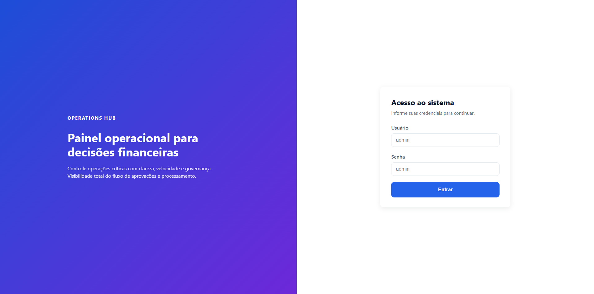
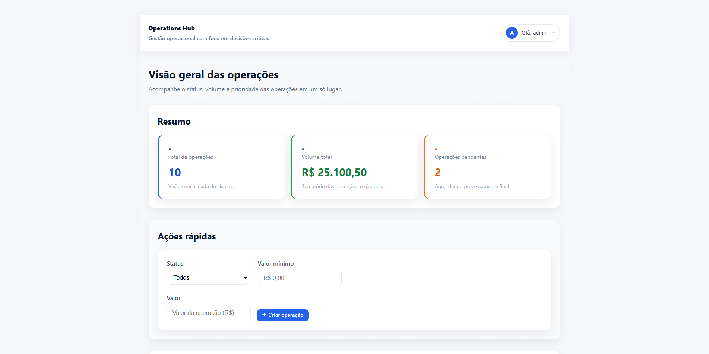
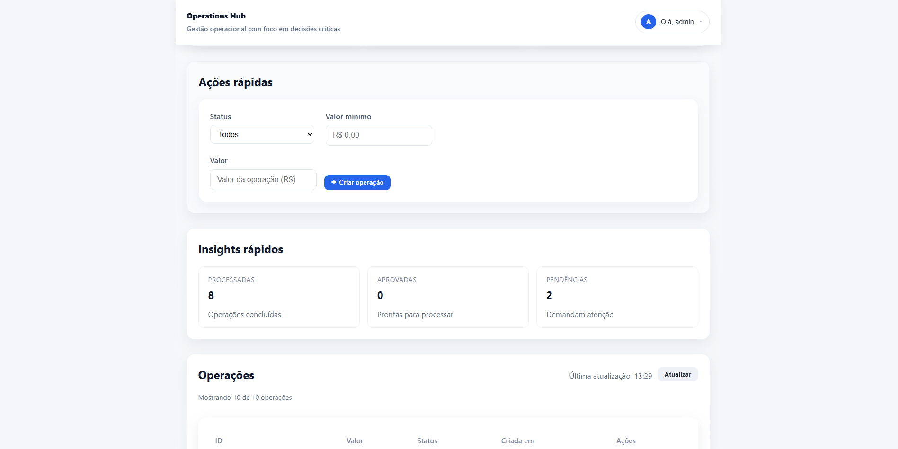
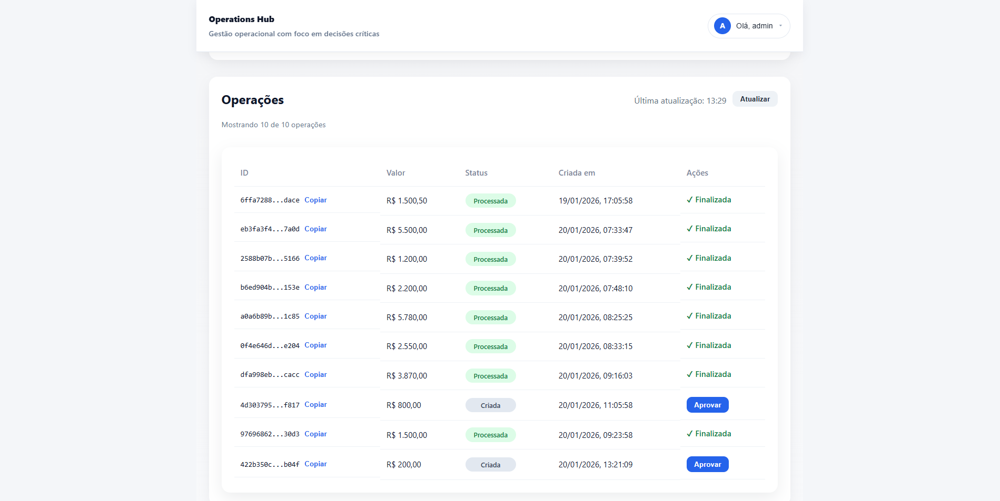

# Operations Hub

Dashboard operacional para gestão de operações financeiras. O projeto foca em regras de negócio claras e uma experiência de uso profissional, com feedbacks visuais e controles de estado no frontend. **Não é um sistema de pagamento real** — o objetivo é demonstrar engenharia de software e UX em um cenário corporativo.

## Preview do sistema
## Screenshots do sistema

### Tela de login


### Dashboard – Visão geral


### Operações


### Criação de operação



## Stack utilizada
- **Frontend:** React + TypeScript
- **Backend:** .NET 8 (ASP.NET Core) + Entity Framework Core
- **Banco de dados:** PostgreSQL
- **Arquitetura:** separação clara entre API, infraestrutura e frontend

## Funcionalidades principais
- Login com tela dedicada (mock)
- Listagem de operações
- Aprovação e processamento de operações (fluxo de status)
- Filtros por status e valor mínimo
- KPIs (total de operações e volume total)
- Feedbacks visuais (toast, loading, skeleton, animações leves)
- UI limpa e responsiva

## Arquitetura e decisões técnicas
- **Backend em camadas** para separação de responsabilidades e manutenção fácil.
- **Regras de negócio no domínio** para garantir consistência do fluxo (Criada → Aprovada → Processada).
- **DTOs e casos de uso** na aplicação para orquestração clara e testável.
- **EF Core + PostgreSQL** isolados na infraestrutura.
- **Frontend sem bibliotecas extras** para manter o controle de UX e reduzir complexidade.
- **Autenticação mock** no frontend para simular controle de acesso sem acoplar ao backend.

## Como rodar localmente

### Pré-requisitos
- .NET 8 SDK
- Node.js (LTS)
- PostgreSQL

### Backend
1. Configure a string de conexão em `OperationsHub.Api/appsettings.json`:
   - `ConnectionStrings:DefaultConnection`
2. Execute a API:
   ```bash
   cd OperationsHub.Api
   dotnet run
   ```
3. A API ficará disponível, por exemplo, em `http://localhost:5011`.

### Frontend
1. Instale dependências:
   ```bash
   cd operations-hub-web
   npm install
   ```
2. Configure o arquivo `.env`:
   ```
   VITE_API_BASE_URL=http://localhost:5011
   ```
3. Rode o frontend:
   ```bash
   npm run dev
   ```

## Usuário de teste
```
Usuário: admin
Senha: admin
```

## Estrutura de pastas (resumo)
```
operations-hub/
├─ OperationsHub.Api/            # API REST (ASP.NET Core)
├─ OperationsHub.Application/    # Casos de uso e DTOs
├─ OperationsHub.Domain/         # Entidades e regras de negócio
├─ OperationsHub.Infrastructure/ # EF Core, PostgreSQL, repositórios
├─ operations-hub-web/           # Frontend React + Vite
└─ OperationsHub.sln
```
